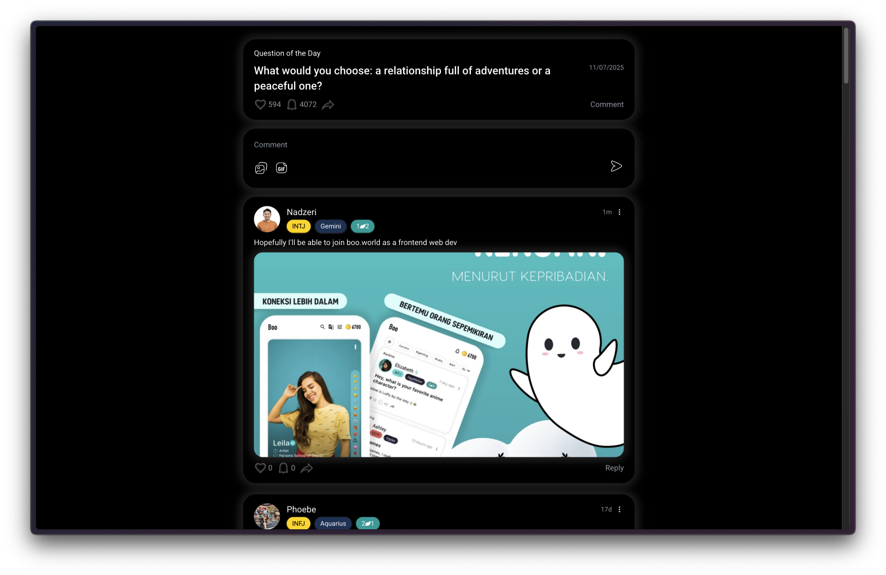

# Boo Questions of the Day

A Next.js application for displaying daily questions with interactive commenting features, including likes, shares, and image attachments.



## Live Demo

🌐 [View Live Demo](https://boo-questions-of-the-f22zuxil7-nadzeri-munawars-projects.vercel.app)

## How to Run

1. Install dependencies:
   ```bash
   npm install
   ```

2. Start the development server:
   ```bash
   npm run dev
   ```

3. Open [http://localhost:3000](http://localhost:3000) in your browser.

## Development Time

- **Start Time**: 20:35
- **End Time**: 00:22
- **Total Time**: ~3.5 hours

## What Was Completed

- ✅ Load question from API (mock data)
- ✅ Display information in the UI:
  - Question card with question text, date, and engagement metrics
  - Comment input composer
  - Comment list with nested structure
- ✅ Actions implemented:
  - Like question (toggle like state and update count)
  - Like comment (toggle like state and update count)
  - Share question (copy link to clipboard with toast notification)
  - Share comment (copy link to clipboard)
  - Create a new comment with text and/or image attachment
  - Add newly created comment to comment list (optimistic update)

## What Was Skipped

- ❌ GIF picker in comment creation
- ❌ Display comment replies (reply functionality not implemented)

## What Would Be Improved With More Time

- Add more functionalities (e.g., edit/delete comments, user authentication, search)
- Enhanced styling and visual design
- Improved UX interactions (animations, transitions, loading states)
- Better error handling and validation
- Accessibility improvements
- Performance optimizations
- Testing (unit tests, integration tests)

